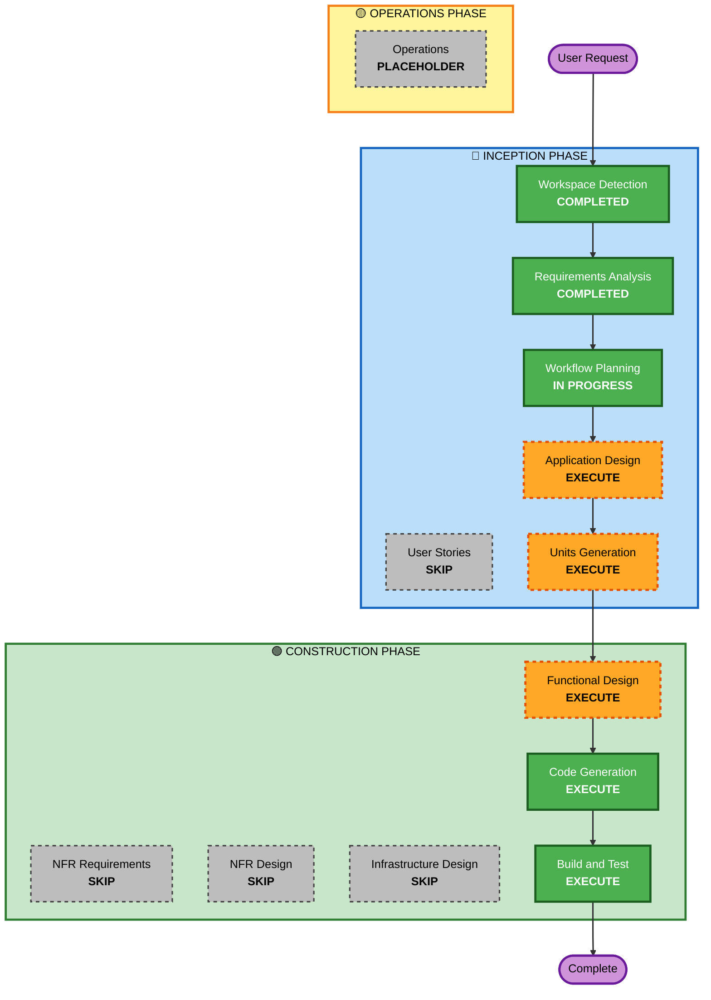

# Execution Plan

## Detailed Analysis Summary

### Change Impact Assessment
- **User-facing changes**: Yes — new CLI tool, new test execution framework
- **Structural changes**: Yes — new monorepo with 4 packages
- **Data model changes**: Yes — Pydantic models for test steps, scenarios, features (evolved from test_translator)
- **API changes**: Yes — CLI interface, AgentCore HTTP endpoints
- **NFR impact**: Yes — caching, performance, extensibility

### Risk Assessment
- **Risk Level**: Medium (building on proven patterns from test_translator)
- **Rollback Complexity**: Easy (greenfield, no production dependencies)
- **Testing Complexity**: Moderate (requires Nova Act + browser for integration tests)

## Workflow Visualization



## Phases to Execute

### 🔵 INCEPTION PHASE
- [x] Workspace Detection (COMPLETED)
- [x] Requirements Analysis (COMPLETED)
- [ ] User Stories - SKIP
  - **Rationale**: Developer tool with clear technical requirements; user stories add minimal value for this type of project. The requirements document already captures all needed functionality.
- [x] Workflow Planning (IN PROGRESS)
- [ ] Application Design - EXECUTE
  - **Rationale**: Multiple packages with clear component boundaries needed. Must define the monorepo structure, package interfaces, and how core/cli/agentcore packages interact.
- [ ] Units Generation - EXECUTE
  - **Rationale**: Monorepo with 4 packages requires decomposition into units of work. Each package is a logical unit with dependencies on others.

### 🟢 CONSTRUCTION PHASE
- [ ] Functional Design - EXECUTE (per-unit, for core package only in first iteration)
  - **Rationale**: Core execution engine has complex business logic (step execution, variable substitution, caching, translation). Needs detailed design before code generation.
- [ ] NFR Requirements - SKIP
  - **Rationale**: Security rules disabled (Q16:B). Performance/scalability handled implicitly through caching design already in requirements. No separate NFR assessment needed.
- [ ] NFR Design - SKIP
  - **Rationale**: NFR Requirements skipped, so NFR Design not applicable.
- [ ] Infrastructure Design - SKIP
  - **Rationale**: AgentCore deployment is a later feature (after most local features done). Infrastructure design will be done when that unit is built. For now, local execution only.
- [ ] Code Generation - EXECUTE (ALWAYS)
  - **Rationale**: Implementation needed. First iteration: core package + CLI with local Gherkin execution.
- [ ] Build and Test - EXECUTE (ALWAYS)
  - **Rationale**: Build, test, and verification needed.

### 🟡 OPERATIONS PHASE
- [ ] Operations - PLACEHOLDER
  - **Rationale**: Future deployment and monitoring workflows

## Incremental Development Strategy

Given the user's requirement to "develop one feature at a time, test it to be working, then move to another feature", the CONSTRUCTION phase will build **Features 1-5** sequentially in this session:

**Feature 1**: Core Gherkin execution engine + custom functions + translation caching + reports + CLI (local browser)
**Feature 2**: Excel data reading + secrets management + screenshot+Claude extraction
**Feature 3**: Common steps (@include) + stop-on-failure + browser mode config
**Feature 4**: Trajectory replay caching
**Feature 5**: AgentCore deployment (orchestrator + test runner)

**Future sessions** (separate AI-DLC runs):
- Feature 6: Gauge support
- Feature 7: Mobile testing (Device Farm)

## Testing Strategy — Incremental Verification

### Principle
Each feature gets its own sample test Gherkin files. After building a feature, run its tests. After every NEW feature, re-run ALL previous tests as regression.

### Sample Test Directory Structure
```
sample-tests/
├── feature-01-core-execution/       # Core Gherkin execution tests
│   ├── basic_navigation.feature     # Simple act steps
│   ├── extraction.feature           # Extract + variable substitution
│   ├── validation.feature           # Validation comparisons
│   ├── background_and_outline.feature  # Background, Scenario Outline, Examples
│   ├── data_tables.feature          # Data table steps
│   └── custom_functions.feature     # Function call steps
├── feature-02-excel-secrets/        # Excel data + secrets tests
│   ├── excel_data_loading.feature
│   └── secrets_injection.feature
├── feature-03-include-stopfail/     # Common steps + stop-on-failure tests
│   ├── include_steps.feature
│   └── common_steps/
│       └── login_flow.steps
├── feature-04-trajectory/           # Trajectory replay tests
│   └── cached_replay.feature
├── feature-05-agentcore/            # AgentCore deployment tests
│   └── remote_execution.feature
└── ...
```

### Verification Commands (simple kick-off)
```bash
# Run tests for a specific feature
ai-qa-test run --feature-dir sample-tests/feature-01-core-execution/

# Run ALL sample tests (regression after adding new feature)
ai-qa-test run --feature-dir sample-tests/

# Quick smoke test (just one scenario)
ai-qa-test run --feature-dir sample-tests/feature-01-core-execution/basic_navigation.feature
```

### Regression Protocol
After each new feature is developed:
1. Run the new feature's sample tests → must PASS
2. Run ALL previous feature sample tests → must still PASS (regression)
3. If regression fails → fix before proceeding to next feature

## Extension Configuration
| Extension | Enabled | Decided At |
|---|---|---|
| Security Baseline | No | Requirements Analysis (Q16:B — PoC/prototype) |

## Estimated Timeline
- **Total Stages**: 5 (Application Design, Units Generation, Functional Design, Code Generation, Build & Test)
- **Estimated Duration**: Significant — complex multi-package project with many modules

## Success Criteria
- **Primary Goal**: Working local + AgentCore Gherkin test execution (Features 1-5 complete)
- **Key Deliverables**: Monorepo with all 4 packages, CLI, AgentCore deployment, sample tests passing
- **Quality Gates**: All sample tests pass per feature, regression passes after each new feature, reports generated correctly
